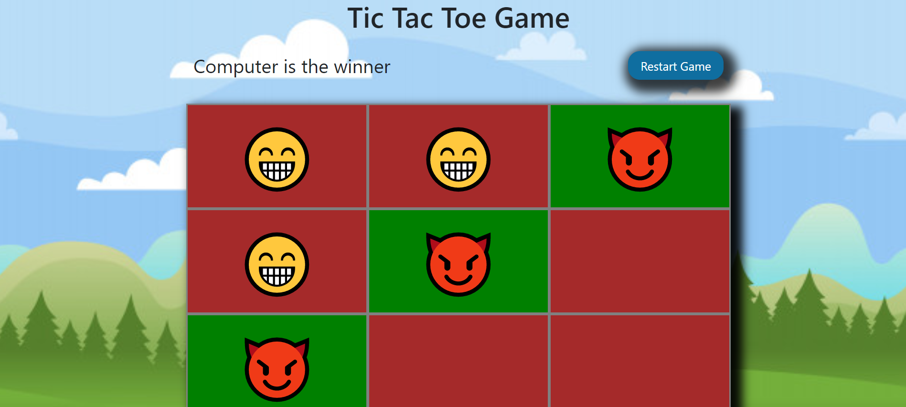

<h1 align="center">:video_game: Tic Tac Toe Project</h1>

  

## :pencil: Description

This project is a Tic Tac Toe game. This game contains the minimax algorithm so the player can compete with the computer. The minimax algorithm makes the computer smart so everytime a user select a cell in the game, the computer will answer with the best move always so the computer never loses. In game theory, minimax is a decision method to minimize the maximum expected loss in games with an opponent and with perfect information. Minimax is a recursive algorithm. User can also play with another user This project is part of the Microverse main curriculum.

## :mag: Minimax Algorithm Example

  

## :heavy_check_mark: Odin Projet Link 

[Tic Tac Toe Project](https://www.theodinproject.com/courses/javascript/lessons/tic-tac-toe-javascript)

## :point_right: Functionalities

- User can create a new Player by adding a name.
- User can select a character before playing.
- User can play with another player.
- User can play with the computer.
- User can restart the game. 

## :computer: Languages

- HTML
- CSS
- Javascript

## :computer: Framework

- Bootstrap

## Author

:man: Julian Belmonte

- Github: [@jucora](https://github.com/jucora)
- Twitter: [@Julian Belmonte](twitter.com/JulianBelmonte)
- Linkedin: [Julian Belmonte](linkedin.com/in/julianbel)
