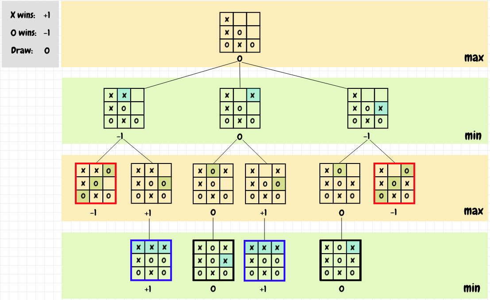

<h1 align="center">:video_game: Tic Tac Toe Project</h1>

  

## :pencil: Description

This project is a Tic Tac Toe game. It contains the minimax algorithm so the player can compete with the computer. The minimax algorithm makes the computer smart, so every time a user selects a cell in the game, the computer will answer with the best move always, so the computer never loses. The minimax is a decision method to minimize the maximum expected loss in games with an opponent and with perfect information. The user can also play with another user. This project is part of the Microverse main curriculum.

# :globe_with_meridians: [Live Version](https://jucora.github.io/tic-tac-toe-Javascript/):point_left:

## :mag: Minimax Algorithm Example

  

## :heavy_check_mark: Odin Projet Link 

[Tic Tac Toe Project](https://www.theodinproject.com/courses/javascript/lessons/tic-tac-toe-javascript)

## :point_right: Functionalities

- The user can create a new Player by adding a name.
- The user can select a character before playing.
- The user can play with another player.
- The user can play with the computer.
- The user can restart the game.

## :arrow_right: Instructions to use the Tic Tac Toe locally

- You can clone the repo by running the next command in your command line: 
  
<code>git clone https://github.com/jucora/tic-tac-toe-Javascript.git</code>

- Next, follow the route: tic-tac-toe-Javascript/dist

- You'll find the index.html file, open it and you're good to go!

## :computer: Languages

- HTML
- CSS
- Javascript

## :computer: Framework

- Bootstrap

## Author

:man: Julian Belmonte

- Github: [@jucora](https://github.com/jucora)
- Twitter: [@Julian Belmonte](twitter.com/JulianBelmonte)
- Linkedin: [Julian Belmonte](linkedin.com/in/julianbel)

## Report Issues

Please feel free to contribute, report any issue, feature request, or provide any feedback. Click [here](https://github.com/jucora/tic-tac-toe-Javascript/issues)

## Support

Feel free to give a :star:. That would support me a lot.
